# 👁️ AILens - AI-Powered Vision Assistant

**Empowering sight through artificial intelligence**

AILens is a revolutionary React Native mobile application that helps visually impaired individuals navigate their surroundings by using TensorFlow Lite for real-time object detection and providing audio feedback about detected objects and their locations.

  

## 🌟 Features

- **Real-time Object Detection**: Uses TensorFlow Lite models to identify objects in the camera feed
- **Spatial Awareness**: Provides location information (left, right, center) for detected objects
- **Audio Feedback**: Text-to-speech announcements of detected objects and their positions
- **Accessibility First**: Designed specifically for visually impaired users with voice navigation
- **Cross-Platform**: Built with React Native for both iOS and Android
- **Offline Capability**: On-device AI processing for privacy and reliability
- **Customizable Models**: Support for different TensorFlow Lite models for various use cases

## 🏗️ Architecture

```mermaid
graph TD
    A[📱 React Native App] --> B[📷 Camera Module]
    A --> C[🔊 Audio Feedback]
    A --> D[⚙️ Settings & Preferences]
    
    B --> E[📹 Vision Camera]
    E --> F[🖼️ Frame Processing]
    F --> G[🤖 TensorFlow Lite Model]
    
    G --> H[🎯 Object Detection]
    H --> I[📍 Position Analysis]
    I --> J[📢 Audio Output]
    
    K[💾 Local Storage] --> G
    K --> L[🔧 Model Management]
    
    subgraph "Core Components"
        E
        G
        H
    end
    
    subgraph "User Interface"
        M[🎙️ Voice Commands]
        N[👆 Touch Navigation]
        O[🔔 Haptic Feedback]
    end
    
    A --> M
    A --> N
    A --> O
    
    style A fill:#e1f5fe
    style G fill:#fff3e0
    style H fill:#f3e5f5
```



## 🔧 Tech Stack

### Core Technologies
- **React Native** `0.79.6` - Cross-platform mobile development
- **Expo** `~53.0.22` - Development platform and build tools
- **TypeScript** - Type-safe development

### AI & Computer Vision
- **react-native-fast-tflite** `^1.6.1` - TensorFlow Lite integration
- **react-native-vision-camera** `^4.7.2` - Camera access and processing
- **vision-camera-resize-plugin** `^3.2.0` - Image preprocessing

### UI & Graphics
- **@shopify/react-native-skia** `^2.2.13` - 2D graphics and overlays
- **react-native-reanimated** `^4.1.0` - Smooth animations
- **expo-blur** - Visual effects

### Accessibility & Audio
- **expo-haptics** - Tactile feedback
- Built-in Text-to-Speech APIs
- Custom audio cues and navigation

## 🚀 Getting Started

### Prerequisites
- Node.js (v18 or higher)
- npm or yarn
- Expo CLI
- iOS Simulator (for iOS development) or Android Studio (for Android development)

### Installation

1. **Clone the repository**
   ```bash
   git clone https://github.com/your-username/ailens.git
   cd ailens
   ```

2. **Install dependencies**
   ```bash
   npm install
   ```

3. **Start the development server**
   ```bash
   npm start
   ```

4. **Run on your preferred platform**
   ```bash
   # For iOS
   npm run ios
   
   # For Android
   npm run android
   
   # For web (development only)
   npm run web
   ```

### Setting up TensorFlow Lite Models

1. Place your `.tflite` model files in the `assets/` directory
2. Update the model configuration in the app settings
3. The app currently includes a default object detection model

## 📱 Usage

1. **Launch the app** and grant camera permissions
2. **Point your device** at objects you want to identify
3. **Listen for audio feedback** describing detected objects and their positions
4. **Use voice commands** or touch gestures to adjust settings
5. **Customize detection sensitivity** and audio preferences in settings

### Voice Commands
- "What do you see?" - Trigger manual detection
- "Repeat" - Repeat last detection results
- "Settings" - Open accessibility settings
- "Help" - Get usage instructions

## 🎯 Detection Capabilities

The AI model can detect and locate:
- **People** and their approximate positions
- **Vehicles** (cars, bikes, trucks)
- **Common objects** (chairs, tables, doors)
- **Obstacles** and navigation hazards
- **Street furniture** (benches, signs, poles)
- **Animals** (when present)

Position feedback includes:
- **Direction**: Left, center, right quadrants
- **Distance**: Near, medium, far (relative)
- **Size**: Small, medium, large objects

## 🛠️ Configuration

### Model Settings
```typescript
const modelConfig = {
  modelPath: 'assets/model.tflite',
  threshold: 0.5,
  maxDetections: 10,
  enableGPU: true
};
```

### Audio Settings
```typescript
const audioConfig = {
  speechRate: 1.0,
  enableHaptics: true,
  announcementDelay: 1000,
  language: 'en-US'
};
```

## 🤝 Contributing

We welcome contributions to make AILens better for the visually impaired community!

1. **Fork the repository**
2. **Create a feature branch** (`git checkout -b feature/amazing-feature`)
3. **Commit your changes** (`git commit -m 'Add amazing feature'`)
4. **Push to the branch** (`git push origin feature/amazing-feature`)
5. **Open a Pull Request**

### Areas for Contribution
- New TensorFlow Lite models
- Improved audio feedback algorithms
- Additional language support
- Performance optimizations
- Accessibility enhancements

## 📋 Roadmap

- [ ] **Advanced Object Tracking** - Follow objects across frames
- [ ] **Indoor Navigation** - Room and furniture detection
- [ ] **Text Recognition** - OCR for signs and documents
- [ ] **Color Identification** - Describe colors of detected objects
- [ ] **Multiple Language Support** - Internationalization
- [ ] **Cloud Model Updates** - Remote model deployment
- [ ] **Wearable Integration** - Smart glasses compatibility

## 🔒 Privacy & Security

- **On-device Processing**: All AI processing happens locally
- **No Data Collection**: No personal data is sent to external servers
- **Camera Privacy**: Images are processed in real-time, not stored
- **Open Source**: Full transparency in code and functionality

## 📄 License

This project is licensed under the MIT License - see the [LICENSE](LICENSE) file for details.

## 🙏 Acknowledgments

- **TensorFlow Team** for the excellent Lite framework
- **Expo Team** for the amazing development platform
- **React Native Community** for ongoing support and libraries
- **Accessibility Community** for feedback and requirements
- **Computer Vision Researchers** whose models make this possible

## 📞 Support

- **Issues**: [GitHub Issues](https://github.com/your-username/ailens/issues)
- **Discussions**: [GitHub Discussions](https://github.com/your-username/ailens/discussions)
- **Email**: support@ailens.app
- **Accessibility Feedback**: accessibility@ailens.app

## 🌍 Impact

AILens aims to improve independence and confidence for visually impaired individuals by providing:
- Enhanced spatial awareness
- Safer navigation in unfamiliar environments
- Real-time environmental information
- Increased accessibility in daily activities

---

**Made with ❤️ for the accessibility community**

*"Technology should enable everyone to see the world in their own way"*